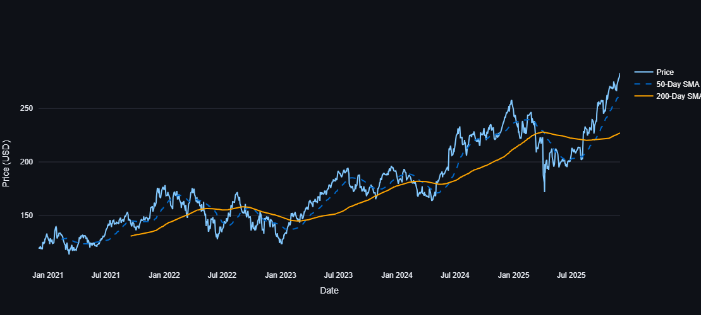
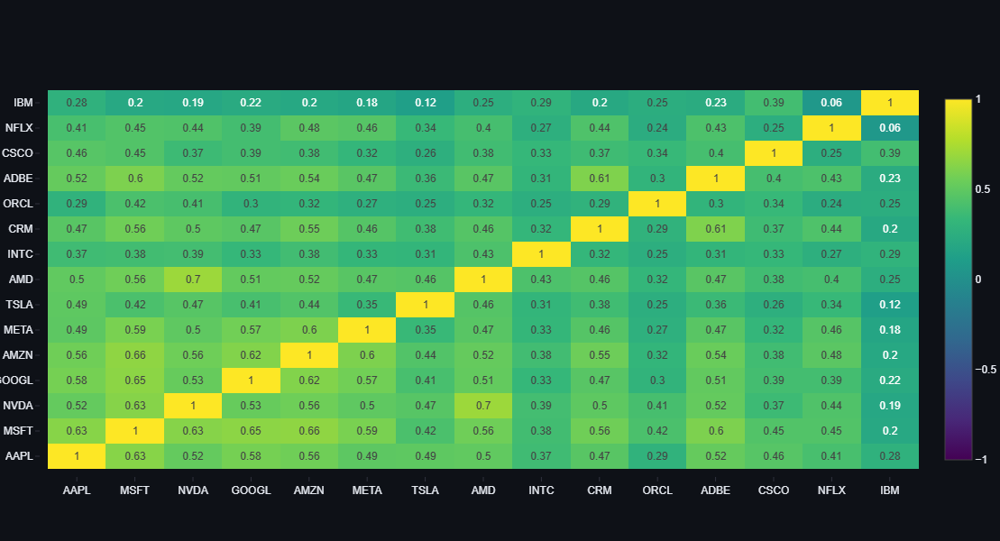

# 📈 S&P 500 Tech Volatility Dashboard

[](https://sp500volatility.streamlit.app/)
[](https://www.python.org/)
[](https://opensource.org/licenses/MIT)

## 📖 Overview

The **S&P 500 Volatility Dashboard** is a full-stack data science application designed to analyze and visualize risk metrics for major technology stocks (e.g., Apple, Nvidia, Microsoft) over a 5-year period.

Bridging financial theory with technical implementation, this tool processes live market data to calculate **Annualized Rolling Volatility**, **Moving Averages (SMA)**, and **Cross-Asset Correlations**, helping users identify market trends and diversification opportunities during economic shifts.

## 🚀 Live Demo

**[Click here to view the live dashboard](https://sp500volatility.streamlit.app/)**

## 📊 Key Features

- **Real-Time ETL Pipeline:** Fetches and cleans 5 years of daily OHLCV data using `yfinance`.
- **Risk Modeling:** Calculates 21-day rolling volatility (annualized) to quantify market fear/uncertainty.
- **Trend Analysis:** Visualizes 50-day and 200-day Simple Moving Averages (SMA) to identify Golden/Death crosses.
- **Correlation Heatmap:** A dynamic matrix identifying systemic risk by tracking how closely tech stocks move in sync.
- **Interactive UI:** Built with **Streamlit** and **Plotly** for responsive, zoomable charts and data caching.

## 🛠️ Tech Stack

- **Core Logic:** Python
- **Data Analysis:** Pandas, NumPy
- **Visualization:** Plotly Graph Objects
- **Web Framework:** Streamlit
- **Data Source:** Yahoo Finance API

## 📸 Screenshots

### 1. Volatility & Price Trends



### 2. Sector Correlation Matrix



## 💻 Installation & Usage

1. **Clone the repository**
   ```bash
   git clone [https://github.com/](https://github.com/)[abdulajalaly]/sp500-volatility-dashboard.git
   ```
